# Looted Site Detection

A unified, reproducible pipeline to detect archaeological site looting from satellite imagery. The repository supports two complementary tracks: (i) feature-based classifiers trained on image embeddings, and (ii) image-based CNNs trained end‑to‑end.

<div align="center">

<em>PlanetScope monthly mosaics (December) and corresponding binary masks for selected locations (2016–2023). Looted sites exhibit disturbed soil tone/texture; preserved sites show uniform surfaces.</em>

<table>
  <thead>
    <tr>
      <th></th>
      <th>2016</th>
      <th>2017</th>
      <th>2018</th>
      <th>2019</th>
      <th>2020</th>
      <th>2021</th>
      <th>2022</th>
      <th>2023</th>
      <th>Mask</th>
    </tr>
  </thead>
  <tbody>
    <tr>
      <td rowspan="2"><strong>Preserved</strong></td>
      <td>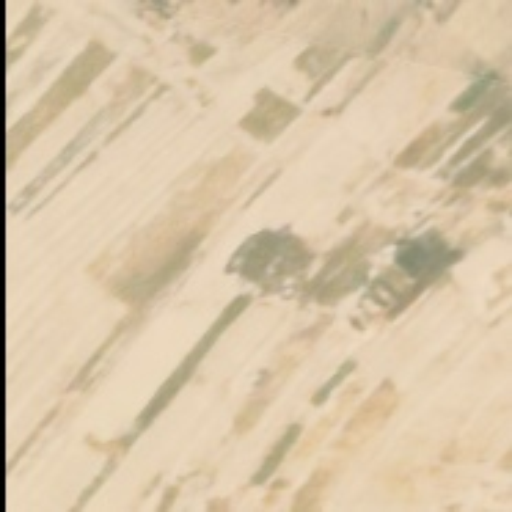</td>
      <td>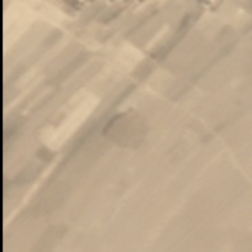</td>
      <td>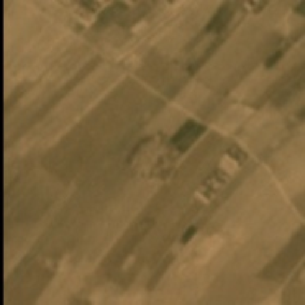</td>
      <td>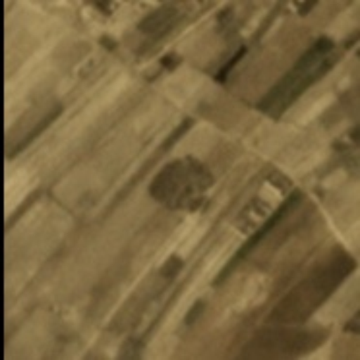</td>
      <td>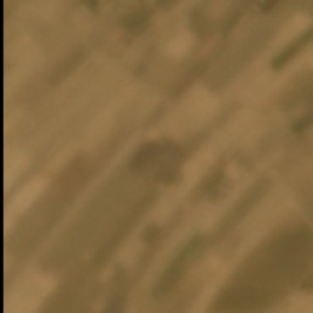</td>
      <td>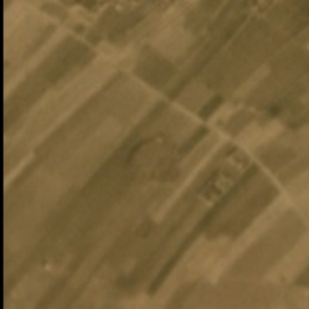</td>
      <td>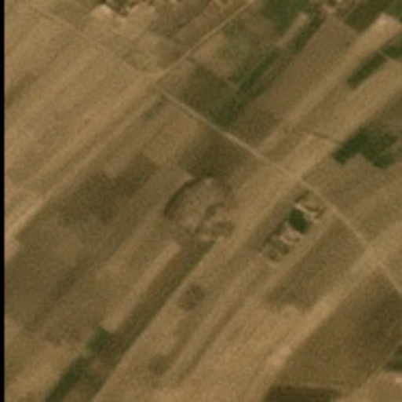</td>
      <td>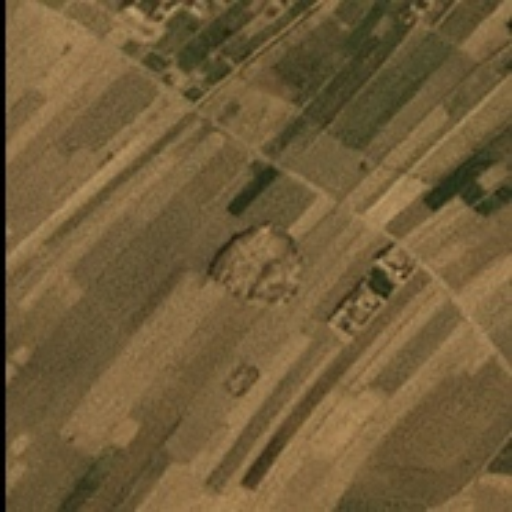</td>
      <td>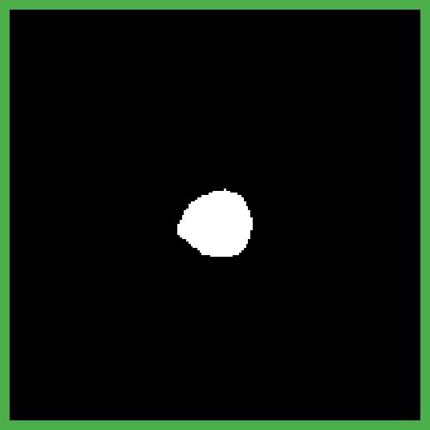</td>
    </tr>
    <tr>
      <td>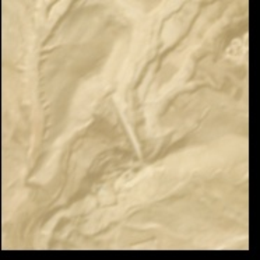</td>
      <td>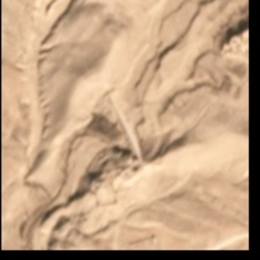</td>
      <td>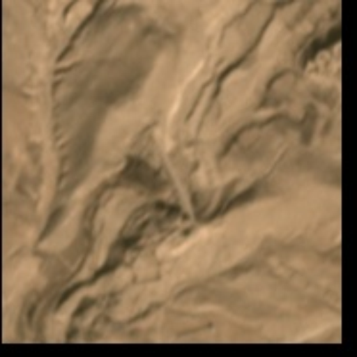</td>
      <td>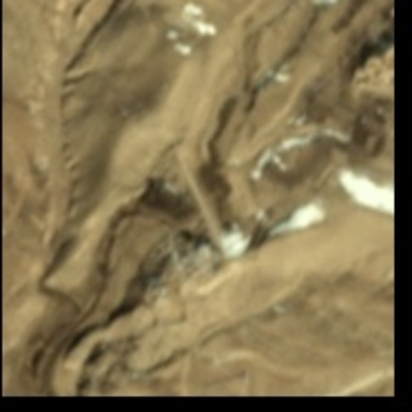</td>
      <td>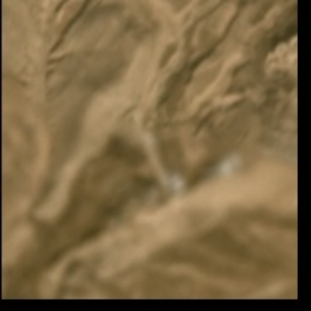</td>
      <td>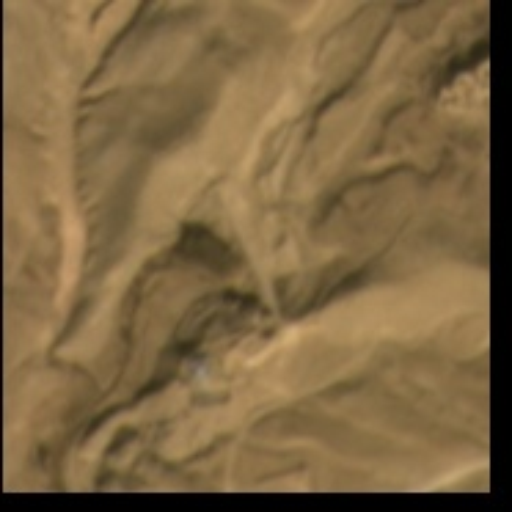</td>
      <td>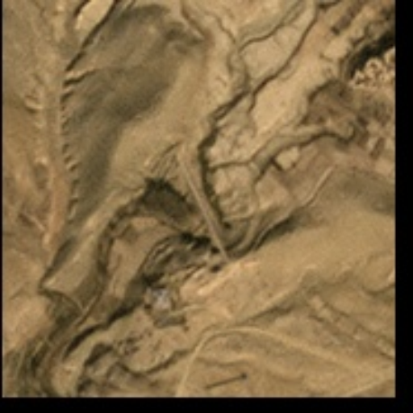</td>
      <td>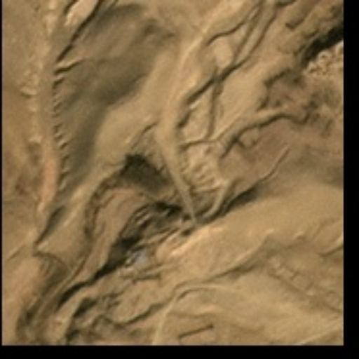</td>
      <td>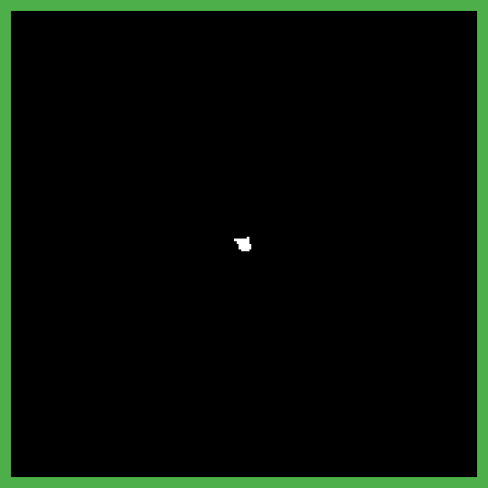</td>
    </tr>
    <tr>
      <td rowspan="2"><strong>Looted</strong></td>
      <td>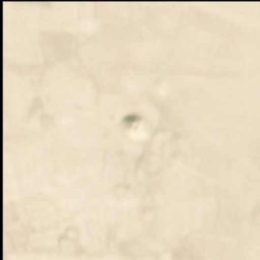</td>
      <td>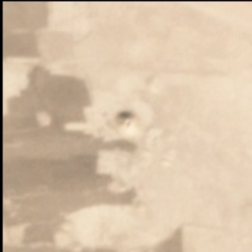</td>
      <td>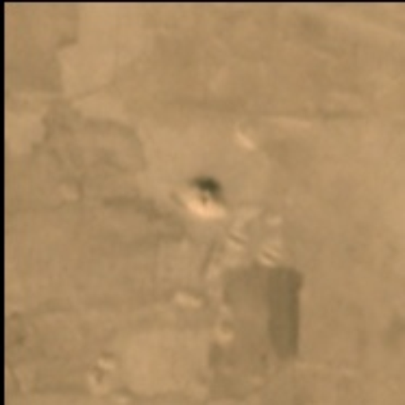</td>
      <td>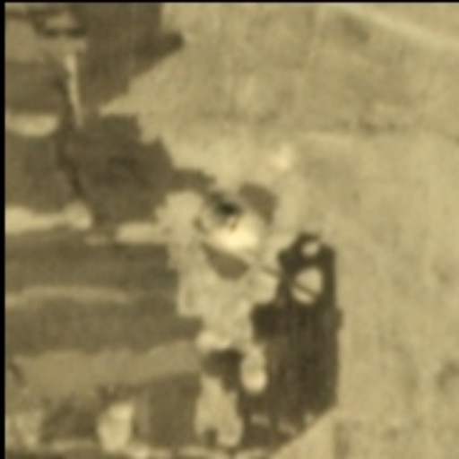</td>
      <td>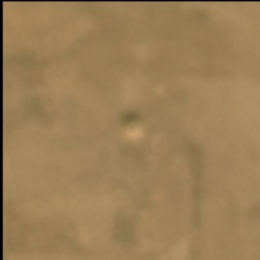</td>
      <td>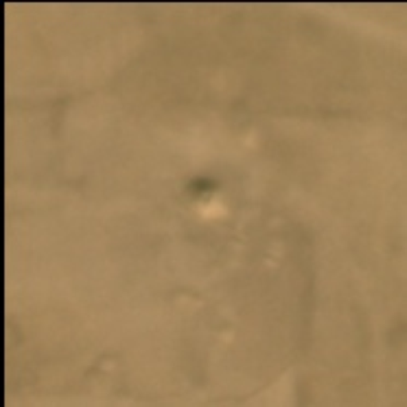</td>
      <td>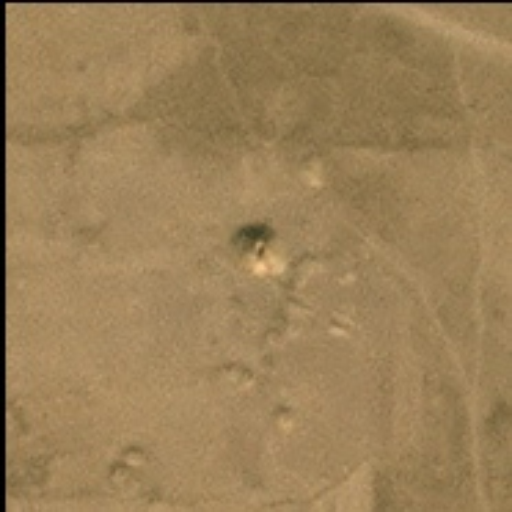</td>
      <td>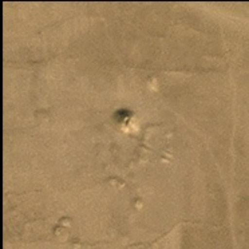</td>
      <td></td>
    </tr>
    <tr>
      <td>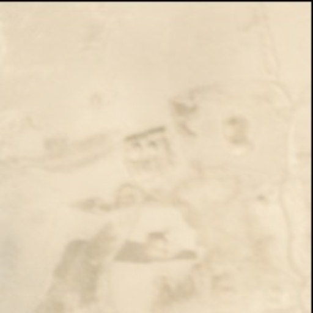</td>
      <td>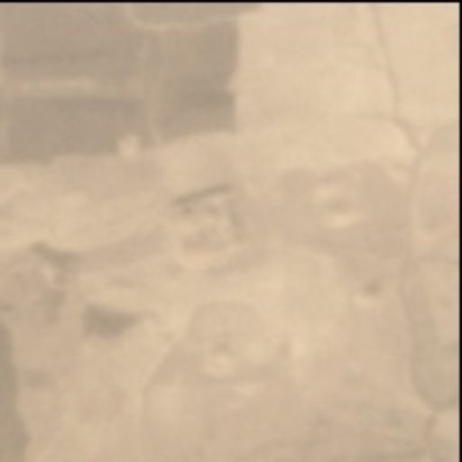</td>
      <td>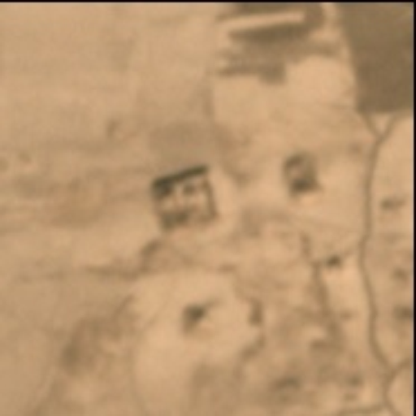</td>
      <td>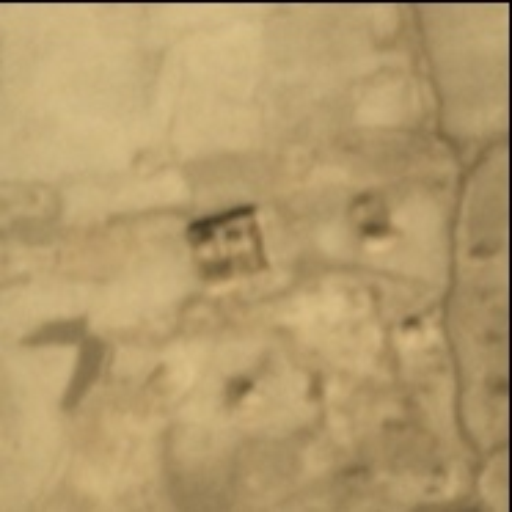</td>
      <td>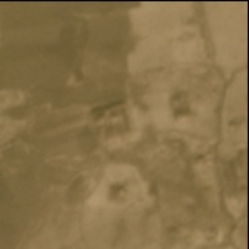</td>
      <td>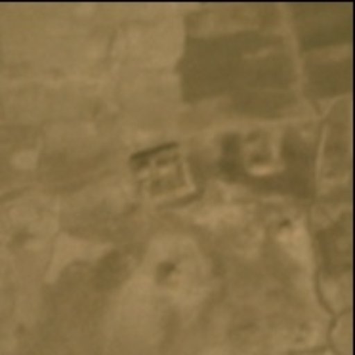</td>
      <td>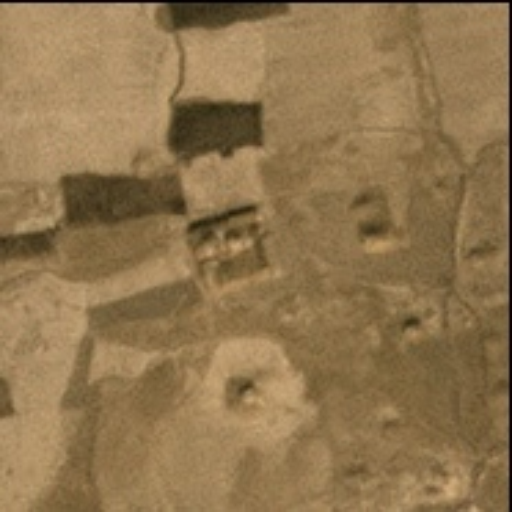</td>
      <td>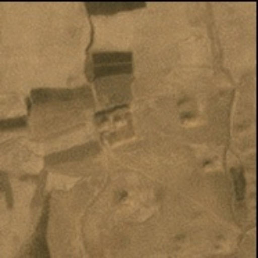</td>
      <td>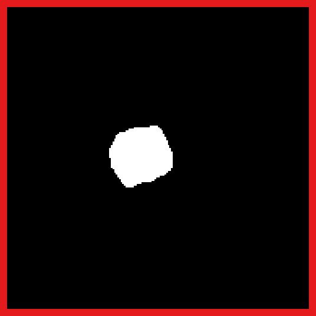</td>
    </tr>
  </tbody>
  
</table>

</div>

Note: The `images/` directory contains small example chips of preserved and looted sites for December 2016–2023, along with their corresponding binary masks. These files are provided to illustrate inputs/labels for the README examples and are not a substitute for the full datasets referenced below.

---

## Overview
- Extract per-site embeddings with several foundation models (GeoRSCLIP, SatCLIP, Prithvi, SATMAE, SatlasPretrain, etc.).
- Train traditional ML models (Random Forest, XGBoost, Logistic Regression) on aggregated embeddings.
- Train CNNs (ResNet, EfficientNet) directly on imagery with optional binary masks.
- Ensure scientific reproducibility via pinned dependencies, stratified splits, and fixed seeds.

## Data Layout (relative paths)
- `data/planet_mosaics_final_4bands/images/<site_id>/<YYYY_MM>.tif`
- `data/planet_mosaics_final_4bands/masks_buffered/<site_id>.png` (optional)
- `data/planet_mosaics_final_4bands/features/` (embedding outputs)

For CNNs, organize a classification dataset with class folders:
- `data/datasets/looted/` and `data/datasets/preserved/` (images or site tiles).

## Installation
```bash
python3.11 -m venv looting_env
source looting_env/bin/activate
pip install -r requirements.txt
```

## Environment Variables (Config Overrides)
- `LOOTED_FEATURE_VARIANT`: selects feature set variant. Values: `with_mask` (default) or `without_mask`. Used by `config.py` to choose `features_with_mask_2023` vs `features_without_mask_2023`.
- `LOOTED_FEATURE_ROOT`: overrides the feature root directory (absolute or repo‑relative).

Examples:
```bash
# Use unmasked features (2023) via variant
export LOOTED_FEATURE_VARIANT=without_mask

# Or override the root explicitly
export LOOTED_FEATURE_ROOT=data/features_without_mask_2023

# Train with embeddings
python -m looted_site_detection.train \
  --model xgb \
  --feature_type satclip \
  --aggregation mean \
  --year 2023 \
  --dynamic_split
```

Optional (evaluation script):
- `CHANGE_DETECTION_DIR`: root containing `planet_mosaics_final_4bands/` (default: `change_detection`).
- `LOOTED_METADATA_PATH`: path to metadata CSV (default: `data/metadata.csv`).

```bash
export CHANGE_DETECTION_DIR=change_detection
export LOOTED_METADATA_PATH=data/metadata.csv
python evaluate_cnn.py --checkpoint path/to/best_model.pth --split test
```

---

## Quick Start

### 1) Extract Embeddings (example: SatCLIP, year 2023)
```bash
python extract_embeddings_unified_modified.py \
  --model satclip \
  --images-root data/planet_mosaics_final_4bands/images \
  --output-dir data/planet_mosaics_final_4bands/features \
  --batch-size 8 \
  --months 2023_01 2023_02 2023_03 2023_04 2023_05 2023_06 2023_07 2023_08 2023_09 2023_10 2023_11 2023_12 \
  --satclip-path huggingface_models/satclip/satclip-vit16-l40.ckpt \
  --satclip-sites-csv data/exports-new/afghanistan_sites_with_coordinates.csv
```
Other supported extractors include `georsclip`, `satmae`, `satlaspretrain`, `dinov3`, `prithvi-eo-2.0`, `copernicus-fm`, and `handcrafted` (see flags in the script).

### 2) Train Feature-Based Models (embeddings)
```bash
python -m looted_site_detection.train \
  --model xgb \
  --feature_type georsclip \
  --aggregation mean \
  --year 2023 \
  --dynamic_split \
  --fold_index 0 \
  --normalize \
  --model_runs_root model_runs_2023
```
Common: `--model {rf,xgb,logreg,gb}`, `--feature_type {handcrafted,georsclip,satclip,satmae,satlaspretrain,...}`, `--aggregation {mean,concat}`.

### 3) Train Image-Based CNNs
```bash
python -m looted_site_detection.train \
  --model resnet18 \
  --year 2023 \
  --dynamic_split \
  --epochs 50 \
  --batch_size 16 \
  --lr 3e-4 \
  --mask_mode multiply \
  --model_runs_root model_runs_cnn
```
Supported: `resnet18`, `resnet34`, `resnet50`, `efficientnet_b0`, `efficientnet_b1` (ImageNet-pretrained by default).

### 4) Evaluation

Traditional (embeddings):
```bash
python -m looted_site_detection.evaluate \
  --model xgb \
  --feature_type georsclip \
  --aggregation mean \
  --year 2023 \
  --dynamic_split \
  --fold_index 0 \
  --normalize \
  --model_runs_root model_runs_2023 \
  --save_probs
```

CNN models:
```bash
python evaluate_cnn.py \
  --checkpoint model_runs_cnn/resnet18/fold_0/model.pt \
  --split test \
  --batch_size 32
```
Tip: to customize dataset roots for CNN evaluation, set `CHANGE_DETECTION_DIR` and `LOOTED_METADATA_PATH` environment variables as shown above.

### 5) Inspect and Aggregate Results
Each run writes `eval_results.json` (accuracy, F1, ROC‑AUC, etc.).
```bash
cat model_runs_cnn/resnet18/fold_0/eval_results.json | jq '.'
python generate_metrics_csv.py --model_runs_root model_runs_cnn
python generate_metrics_csv.py --model_runs_root model_runs_2023
```

---

## Reproducibility
- Dependencies pinned in `requirements.txt`.
- Stratified splits; seed = `42 + fold_index` (set `--fold_index 0..4`).
- Prefer `--year 2023` to align labels with final-state imagery.
- Pass repository‑relative paths; avoid absolute paths.

## Repository Map
- `train.py`: Unified training (CNNs and traditional ML).
- `models.py`, `cnn_models.py`: Model factories and CNN backbones.
- `cnn_dataset.py`, `data.py`: Datasets for images/features.
- `splits.py`, `dynamic_split.py`, `dynamic_split_images.py`: Split utilities (feature-based and image-based).
- `utils.py`: Common helpers.
- `extract_embeddings_unified_modified.py`: Embeddings extraction.
- `results/`, `model_runs*/`, `data/`: outputs and datasets (gitignored).

## Citation
If you use this work, please cite:

```bibtex
@inproceedings{tadesse2026satellite,
  title={Satellite-Based Detection of Looted Archaeological Sites Using Machine Learning},
  author={Tadesse, Girmaw Abebe and Bartette, Titien and Hassanali, Andrew and Kim, Allen and Chemla, Jonathan and Zolli, Andrew and Ubelmann, Yves and Robinson, Caleb and Becker-Reshef, Inbal and Ferres, Juan Lavista},
  booktitle={Proceedings of the IEEE/CVF Winter Conference on Applications of Computer Vision},
  pages={840--848},
  year={2026}
}
```

## License and Notices
- MIT License — see `LICENSE`.
- Third‑party notices — see `THIRD_PARTY_NOTICES.md`.

---

For questions or issues, please open a GitHub issue.

Last Updated: March 2026
